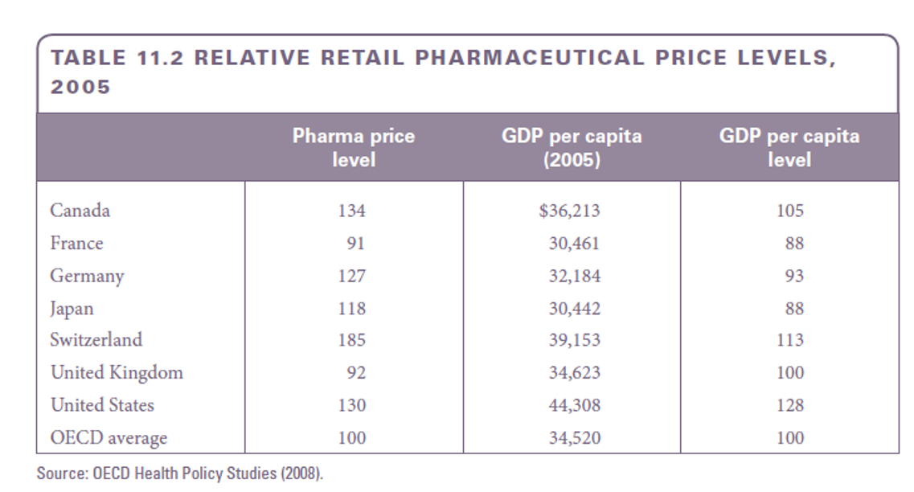
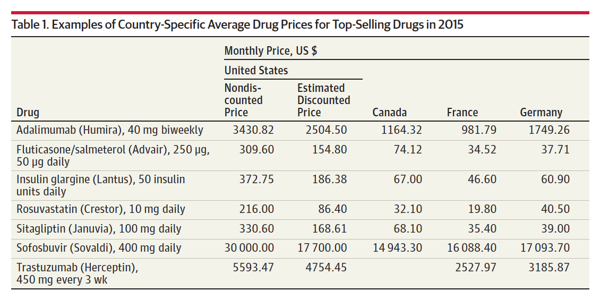

---
format:
  revealjs:
    theme: styles.scss
    transition: fade
    slide-number: true
    wide: true
    chalkboard: true
    margin: 0.1
    footer: "Introduction to Health Economics | Fall 2026 | Session 11"
    controls: true
---

::: {.title-slide}

# The market for pharmaceuticals

<br>

**Wu Zeng, MD, PHD**

<br>

Associate Professor

Department of Global Health

Georgetown University

`wz192@georgetown.edu`

<br>

[Claimer]{.themec}: I declares no conflict of interest

:::

---
```{r setup, include=FALSE}

knitr::opts_chunk$set(echo = FALSE, warning = FALSE, message = FALSE, 
  comment = NA, dpi = 300, fig.align = "center", out.width = "80%", cache = FALSE)
options(scipen = 999)
library(tidyverse)
library(DiagrammeR)
library(widgetframe)
library(readxl)
library(kableExtra)
```

## Outline 


---

## Overview

- Prescription drugs and the pharmaceutical industry occupy increasingly important places in the health economy

- Drug therapies traditionally have supplemented nutrition, sanitation, and medical care as methods for preserving health

- Despite these successes, the U.S. pharmaceutical industry has been under intense media and legislative scrutiny.

- Pharmaceutical firms are among the largest and most profitable businesses in the United States

---

## Overview continued...

- We will focus on
    - The role of pharmaceutical products in the production of health, patient choices of drugs
under various insurance schemes, and the effects of technological change on the use of
drugs
    - Drug pricing issues, including price discrimination by sellers and price regulation by the
government
    - Pharmaceutical research, the determinants of innovation, and the effects of price
regulation on innovation
    - Cost containment through use of generic products and other measures

---

## Structure of the pharmaceutical industry

- The U.S. has relied on private sector initiative and market mechanisms for the
direction of research and development
- In the pharmaceutical industry, government, private philanthropy and academia
intimately involved in new product development
- Government sponsors little applied research towards commercialization of a product
- Government & private philanthropy directly fund basic research to advance knowledge

---

## The size of pharmaceutical industry


::: {.columns}

::: {.column width="50%"}

- In 2006, spending on prescription drugs
amounted to $217 billion or 10.3 percent
of national health expenditures, up from
8.9 percent in 2000 and just 4.7 percent
in 1980
- With its long history of relatively high
profits and rich set of features— patent
protection, high research and
development spending, intense product
promotion, and heavy regulation—the
pharmaceutical industry always has
drawn the attention of economists in the
field of industrial organization.

:::

::: {.column width="50%"}


:::

:::

---

## Top 10 pharmaceutical companies in the world

<center>


</center>

--- 

## US spending on prescription drugs vs. other countries

<center>


</center>

--- 

## The role of research and development in the pharmaceutical industry

- The pharmaceutical industry is one of the most research-intensive industries in the world, with R&D spending accounting for a significant portion of total revenue.
- The world’s largest pharma firms spent over $500 billion on R&D since 2000, and
$51.2 billion in 2014, which is 17.9% of their combined sales of $286 billion.
- 75% of the world’s total R&D spending in pharmaceuticals is based in U.S
- Introduction of new drugs is a major determinant in profitability; the longer a drug is
on the market, the lower its return on sales

---

## R&D process 

### New Drug development: FDA

- Government regulatory body for the industry
- Imposes requirements on product testing, safety, effectiveness, and marketing of
pharmaceutical products
- Monitors for proper manufacturing and labeling standards
- Also responsible for food, medical devices, and cosmetics products
- The FDA approval does not mean a product is harmless

---

## New drug application

- FDA reviewer’s key decisions:
    - “Whether the drug is safe and effective in its proposed use(s), and whether the benefits
of the drug outweigh the risks.
    - Whether the drug’s proposed labeling (package insert) is appropriate, and what it should
contain.
Whether the methods used in manufacturing the drug and the controls used to maintain
the drug’s quality are adequate to preserve the drug’s identity, strength, quality, and
purity.

---

## Steps in the pharmaceutical R&D process

<center>


</center>

---

## Policy toward innovation 

- US government encourages innovation through patent protection and market exclusivity
- Patent law 
    - 1984: Drug Price Competition and Patent Term Restoration Act (Hatch-Waxman Act)
        - Extended the effective patent life of a drug by 5 years to compensate for time lost during the FDA approval process
        - Allowed generic manufacturers to file an abbreviated new drug application (ANDA) to market a generic version of a drug without repeating the costly clinical trial
- Internationally, the World Trade Organization (WTO) requires member countries to provide patent protection for pharmaceutical products for at least 20 years from the date of filing

---

## Impact patient on drug prices 

### Monopoly pricing through patents

::: {.columns}

::: {.column}

- Patents of drugs distort drug prices, limit treatment options for individuals who do
not have the means to pay, and cause American consumers to pay too much for their
prescription medicines
- The awarding of a patent provides the innovator with monopoly power – to limit
availability and set prices above the marginal cost of production
- The profit-maximizing output occurs where MC equals MR. The monopolist then
charges the highest price the market will bear, which is given by the demand curve. If
price exceeds average cost a profit will be earned

:::

::: {.column}


:::

:::

---

## The impact of insurance on drug prices

::: {.columns}

::: {.column}
- Insurance copayment provisions invite firms with market power to raise their price according to the inverse of the copay
- Insurance shifts demand from D1 to D2 (increases demand)
    - User coinsurance rate (c) determines the magnitude of the shift
    - 100 percent insurance (c = 0) implies the demand curve is vertical
- The 50 percent copay results in the monopolist doubling their prices
    - Price changes from P1 to P2
    - Monopolist could adjust the resulting price-quantity point on the new demand curve by moving from initial quantity only if profits increase

:::

:::{.column width="50%"}

<center>


</center>

:::
:::

---

## Advertising and Promotion
- Pharmaceutical companies spent $27 billion on marketing and promotion in 2010
    - 70 percent comprised free samples and promotion to physicians
    - Only $56 billion went to research and development the same year
    - Many companies (especially generic producers) can spend twice as much on marketing and administration as research and development
    - Wholesale price of new drugs three to six times higher than cost of production
    - Profits are funneled into advertising and promotion (directed at providers)

---

## Advertising and Promotion continued...

- Though most promotion targets physicians, advertising targeting end consumers has grown significantly
    - Direct to-consumer advertising (DTCA) rose from $791 million in 1996 to $6.1 billion in 2019
    - Critics fear that this promotion motivates without educating consumers
    - However, most physicians believe that direct to-consumer advertising informs and educates patients, and the majority of patients believe it increases awareness for new drugs and improves communication with physicians (Moser, 2003)
    - Direct to-consumer advertising has no effect on price (Rubin, 2003) but can drastically increase sales (Jenkins, 2000)

--- 

## Common pricing control policies

- Regulation of mark-ups in the pharmaceutical supply and distribution chain (UK)
- Tax exemptions/reductions for pharmaceutical products
- Application of cost-plus pricing formulae for pharmaceutical price setting or negotiated prices ceiling (Canada)
- Use of external reference pricing (Germany)
- Promotion of use of generic medicines
- Use of health technology assessment

---

## Relative retail pharmaceutical price levels, 2005

<center>



</center>

---

## Drug prices in different countries


<center>



</center>

---

## Questions and comments {.center}